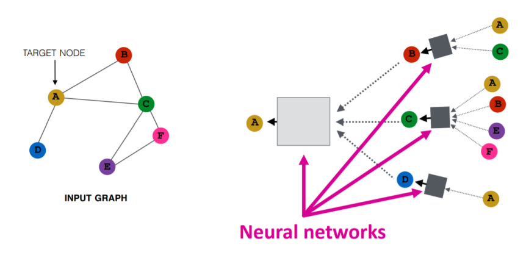
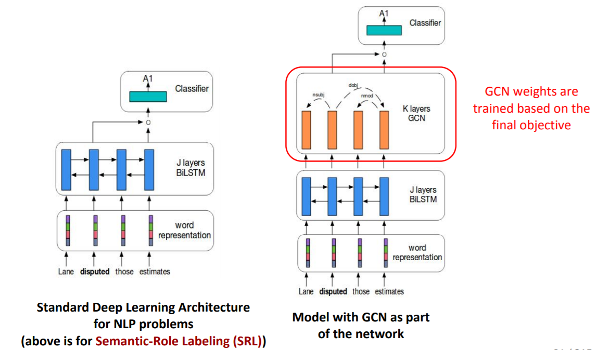
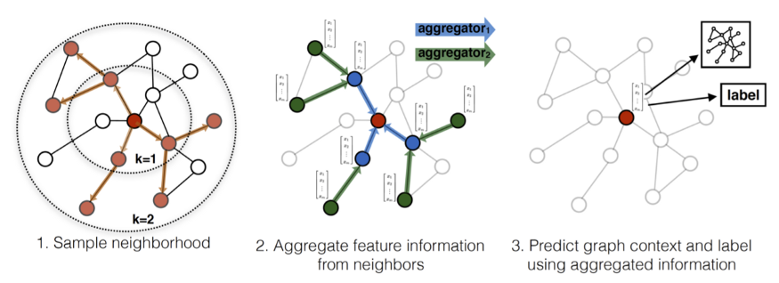

# Graph Neural Networks (GNNs)

## Introduction
Current Machine Learning algorithms like Support Vector Classifier, Naïve Bayes, etc. expect independent features. That’s rarely the case, especially for Natural Language Processing (NLP) applications. The dataset itself is in form of graph, ie, nodes and arcs as relations, such as social networks, molecules, graphics meshes, etc.  Sparse or Dense embeddings used in ML of NLP, are related to each other contextually, albeit linearly ie 1D convolution like. Thus, traditional ML algorithms do not learn the representation (underlying structure) well and demand need of an inter-dependent representation system such as Graph Neural Networks.

Challenges in NLP would be:
- Using what logic would text paragraph or sentence will become a graph with words as nodes and arcs as ? Including documents as nodes as well? Spectral way of graph formation does not look intuitive
- Using what logic text graph would be convoluted and pooled to form one embedding for whole text sentence/paragraph? Also, should have ability to give node-level ie word embeddings which will incorporate context via neighboring arcs and nodes.

## Potential
- Relatively new and upcoming domain
- Widely applicable: Social Networks, logistics, molecular biology, mesh graphics, etc.
- Active research in Big companies, 
- Usable in MidcurveNN

## Libraries
- DGL https://www.dgl.ai/ Build your models with PyTorch, TensorFlow or MXNet. By Amazon.
- tf2-gnn https://github.com/microsoft/tf2-gnn Graph neural network in TensorFlow 2.0. By Microsoft.
-	Spektral: graph deep learning, based on the Keras API and TensorFlow 2  https://graphneural.network/  https://arxiv.org/pdf/2006.12138.pdf 
- Pyorch Geometric https://github.com/rusty1s/pytorch_geometric Deep learning on graphs and other irregular structures. By Facebook.
- Graph4NLP (video)[https://www.youtube.com/watch?v=7PiuwUBnwD0&t=586s], (presentation)[https://drive.google.com/file/d/1_7cPySt9Pzfd6MaqNihD4FkKI0qzf-s4/view]

## Notes
- CS224W: Machine Learning with Graphs | 2021 
	- Node Embedding: Have encoder network such that, cosine similarity of neiboring nodes is close.
	- GNNs (Graph Neural Networks) are Deep Graph Encoders. They are end-to-end learning machines.
	- Two steps: Decide node neighborhood, agreegate at a node using neighbors.

- KDD 2020: Hands-on Tutorials: Scalable Graph Neural Networks with Deep Graph Library https://www.youtube.com/watch?v=Nd2BbbviOdk
  - Tasks in Graph Learning
		- Node Classification: 
			- Detect malicious accounts
			- Target right customers
		- Link Prediction
			- Recommendations
			- Predict missing relations in knowledge graph
		- Graph Classification
			- Predict property of entire graph like chemical compound
	- Embed nodes-edges- graph info in a vector and then use it for classifies.
		- Using manual feature engineering
		- Using unsupervised dimensionality reduction
		- Use Graph Neural Networks to learn embeddings, end-to-end fashion
	- GNNs are naturally inductive because they learn the same neural networks on all the nodes and edges. A new node in graph can be used for prediction, while it has been trained on the remaining sub-graph. 
	- GNNs do not learn embedding as such but the function from input to output. But if you use one-hot embedding on nodes-edge, then inductive bias is lost and then becomes transaction-based.
	- GNNs take graph, update node embeddings, those then participate in node-wise prediction. Similarly for edge-graph level embeddings.
	- For graph level embedding some aggregation (called 'readout' function) node-edge embeddings.

- A Comprehensive Survey on Geometric Deep Learning - Wenming Cao, IEEE
	- Euclidean domain == grid-like data. Full and fixed size.
	- Non-Euclidean domain == Graphs and manifolds. Not fully connected and variable size.
	- Deep Learning for non-Euclidean domain is called Geometric Deep Learning. 
	- Graph is composed of nodes and edges of the network structure data.
	- Manifold data is geometric surface, modeled as point cloud. Irregularly arranged and randomly distributed, thus difficult to find neighbors.
	- Laplacian Matrix is difference of Degree Matrix (diagonal having node incidences) and the Adjacency Matrix
	- Spectral method is the eigen-decomposition of Laplacian matrix
	- a manifold is a topological space that locally resembles Euclidean space near each point ie Tangent plane is 2D for 3D surface at a neighborhood of a point.
	- GCN is spectral method
	- GNN is recursively updating the hidden representation of nodes until convergence, aka  recurrent-based spatial GCN
	- Mixture Model Networks (MoNet) is  a unified framework that can extend the CNN structure to non-Euclidean domains (graphs and manifolds), and can learn local, stationary and combinatorial specific task characteristics.
	
- A Friendly Introduction to Graph Neural Networks https://www.kdnuggets.com/2020/11/friendly-introduction-graph-neural-networks.html
	- RNNs are for sequences, which compute not only using inputs but also previous hidden state.
	- For GNN, there is no one input at a time, but whole graph input state. First, each node aggregates the states of its neighbors, called Message Passing.
	- We can simply matrix-multiply the array of node states by the adjacency matrix to sum the value of all neighbors and thus update the nodes states.
	
	
- Deep Learning on Graphs: Successes, Challenges, and Next Steps | Michael Bronstein https://www.youtube.com/watch?v=qrV1KJREGuk
	- Recipes for Graph Convolution
		- Weights are independent of features: Y = A(W)X , 'A' is non-linearity Activation. Ex. ChebNet, GCN, SGCN
		- Weights are dependent on features: Y = A(W,X)X  Ex. MoNer, Graph Attention Networks
		- Activation is dependent on features X' = A_X (W,X)  Ex. Message Passing Neural Networks (MPNN), EdgeConv, Graph Networks
	- Latent Graph: Even though data does not have explicit graph structure, internally it has hidden (latent) graph structure. This is actually Manifold Learning. There, high dimensional data, can be reduced to core lower dimensional Manifold (3d surface has 2d planar manifold, ie in neighborhood).

- How to get started with Graph Machine Learning, Aleksa Gordic, https://gordicaleksa.medium.com/how-to-get-started-with-graph-machine-learning-afa53f6f963a
	- Example of Graph based regression: Maybe the nodes in your graphs are tweets and you want to regress the probability that a certain tweet is spreading fake news. Your model would associate a number between 0 and 1 to that node and that would be an example of a node regression task.
	- Graph embedding methods: 
	  - 'Deep Walk': sample “sentences” from the graph by doing random walks.
		- Once you have the sentence you can do the Word2Vec magic and learn your node embeddings such that those nodes that tend to be close in your sentences have similar embeddings.
	- Graph Neural Networks:
		- Spectral methods try to preserve the strict mathematical notion of convolution and had to resort to the frequency domain (Laplacian eigenbasis) for that. Main idea is to project the graph signal into that eigenbasis, filter the projected graph signal directly in the spectral domain by doing an element-wise multiplication with the filter, and reproject it back into the spatial domain. They are computationally expensive, so not used much.
		- Spatial (message passing) methods are not convolutions in the strict mathematical sense of the word, but we still informally call them convolutions, as they were very loosely inspired by the spectral methods. The goal is to update each and every node’s representation. You have the feature vectors from your node and from his neighbors at disposal. GCN uses constants instead of learnable weights as by GAT, while aggregating neighbors.
		  - GraphSAGE — SAmple and aggreGatE, it introduced the concept of sampling your neighborhood and a couple of optimization tricks so as to constrain the compute/memory budget.
		  - PinSage — One of the most famous real-world applications of GNNs — recommender system at Pinterest.

-	Graphs Neural Networks in NLP. Capturing the beautiful semantic… | by Purvanshi Mehta | NeuralSpace | Medium
 
 
  -	Although powerful attention mechanisms can automatically learn the syntactic and semantic relationships, it is linear and may have to be constrained to pick correct relationship.
  -	Knowledge Graphs need to be input for NLP applications.

-	A Tutorial on Graph Neural Networks for Natural Language Processing https://shikhar-vashishth.github.io/assets/pdf/emnlp19_tutorial.pdf  https://arxiv.org/abs/1911.03042 

After standard LSTM, in sentiment classification algorithm, we can have Graph relations embedded in GCN and then do classification.

-	Graph Convolutional Networks for Geometric Deep Learning https://towardsdatascience.com/graph-convolutional-networks-for-geometric-deep-learning-1faf17dee008
  - Graph Embedding: transforming a graph to a lower dimension.
  - Graph Convolution: convolutional methods are performed on the input graph itself, with structure and features left unchanged.
  - Images are represented on a 2-dimensional Euclidean grid, where a kernel can move left, right, etc. Graphs are non-Euclidean, and the notion of directions like up, down, etc. don’t have any meaning. Graphs are more abstract, and variables like node degree, proximity, and neighborhood structure provide for more information about the data. So, the ultimate question is: How do we generalize convolutions for graph data?
  - Types:
	  - Spectral Graph Convolutional Networks: Graph Fourier transform. clustered graph would be sparse in the frequency domain allowing for a more efficient representation of the data.
	  - Spatial Graph Convolutional Networks: Neighborhood sampling, Aggregation, Prediction

-	An Introduction to Graph Neural Networks: Models and Applications https://www.youtube.com/watch?v=zCEYiCxrL_0
  - Input is nodes with own vector form. Output of GNNs is again nodes but with context information added to the node vector form. All incident edges info is in built now.
  - This update happens n all nodes, once at each time step, for n epochs.

