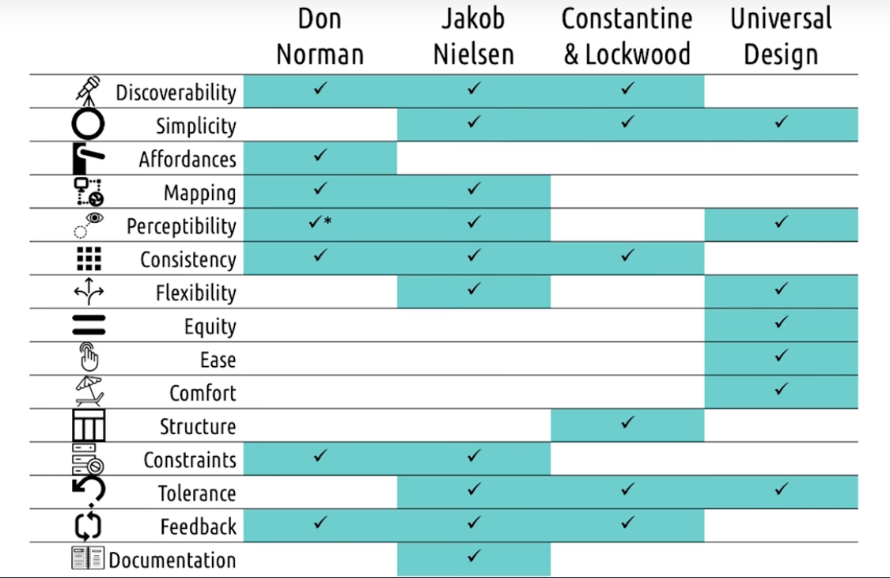

# Human-Computer Interaction, Udacity, Georgia Tech

## Chapter 1
- In any action there are 3 things
	- Doer
	- Interface
	- Task
- Goal: To get Task done, where Doer does not feel that Interface is there.
- Objective of HCI: User should get Task done without Interface being felt there.
- Usability: efficiency and user satisfaction.
- Roles Humans play:
	- Processor: take input-split output, sensory, dumb-automatic, physically usable, quantitative studies for evaluation.
	- Predictor: use of knowledge-experience, cognitive, learning needed, qualitative studies for evaluation
	- Participant: gets external inputs as well, judge relative importance, contextual, in situ studies for evaluation
	
# Chapter 2
- Gulf of Execution: 
	- How do I know how to achieve goals? 
	- Distance between what user thinks he has to do and things he has to actually do, via interface.
	- Make functions discoverable
	- Let user mess around
	- Be consistent with other tools
	- Know your user
	- Feed forward
- Gulf of Evaluation:
	- Is action over, is output done?
	- Interpret results
	- Evaluation of results to see if goals are achieved.
- Don Norman's Principles
	- 1. Visibility: Users should know, just by looking at an interface, what their options are and how to access them.
	- 2. Feedback: The user must receive feedback after every action they perform to let them know whether or not their action was successful.
	- 3. Affordance: Link between how things look and how they’re used. 'Affords' means 'hints at'.
	- 4. Mapping: Controls for something will closely resemble their effect. 
	- 5. Constraints: Restrict a particular form of user interaction with an interface. 
	- 6. Consistency: Key for these patterns to be recognized and learned by users.
- Nielsen 10 Interaction Principles
	- Visibility of system status. The system should always keep users informed about what is going on, through appropriate feedback within reasonable time.
	- Match between system and the real world. The system should speak the users’ language, with words, phrases and concepts familiar to the user, rather than system-oriented terms. Follow real-world conventions, making information appear in a natural and logical order.
	- User control and freedom. Users often choose system functions by mistake and will need a clearly marked «emergency exit» to leave the unwanted state without having to go through an extended dialogue. Support undo and redo.
	- Consistency and standards. Users should not have to wonder whether different words, situations, or actions mean the same thing. Follow platform conventions.
	- Error prevention. Even better than good error messages is a careful design which prevents a problem from occurring in the first place.
	- Recognition rather than recall. Make objects, actions, and options visible. The user should not have to remember information from one part of the dialogue to another. Instructions for use of the system should be visible or easily retrievable whenever appropriate.
	- Flexibility and efficiency of use. Accelerators – unseen by the novice user – may often speed up the interaction for the expert user such that the system can cater to both inexperienced and experienced users. Allow users to tailor frequent actions.
	- Aesthetic and minimalist design. Dialogues should not contain information which is irrelevant or rarely needed. Every extra unit of information in a dialogue competes with the relevant units of information and diminishes their relative visibility.
	- Help users recognise, diagnose, and recover from errors. Error messages should be expressed in plain language (no codes), precisely indicate the problem, and constructively suggest a solution.
	- Help and documentation. Even though it is better if the system can be used without documentation, it may be necessary to provide help and documentation. Any such information should be easy to search, focused on the user’s task, list concrete steps to be carried out, and not be too large.
- Mace's 7 Principles
	- Principle 1: Equitable Use.
	- Principle 2: Flexibility in Use.
	- Principle 3: Simple and Intuitive Use.
	- Principle 4: Perceptible Information.
	- Principle 5: Tolerance for Error.
	- Principle 6: Low Physical Effort.
	- Principle 7: Size and Space for Approach and Use.
-  "15 Combo Design Principles")
