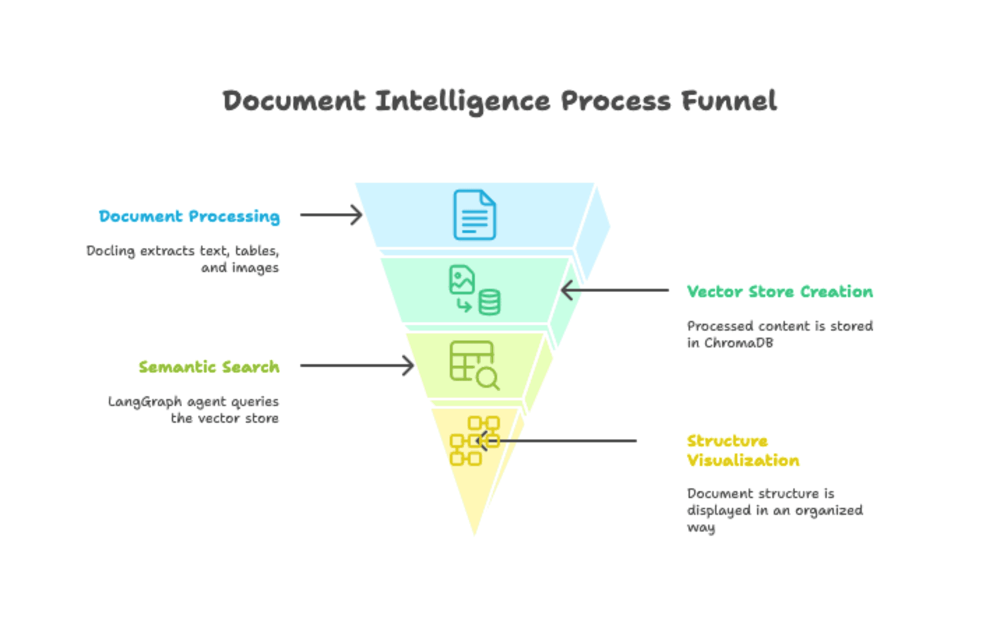
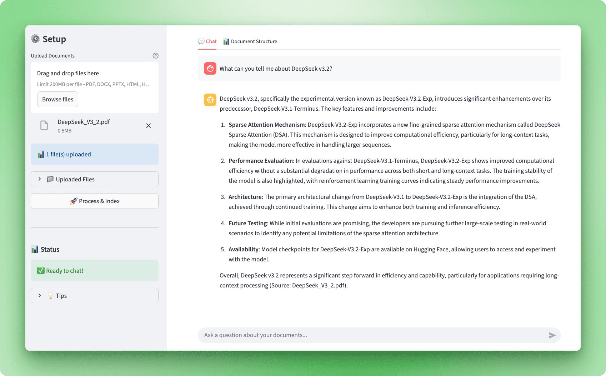
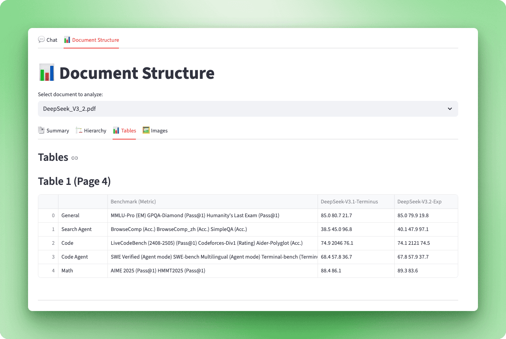
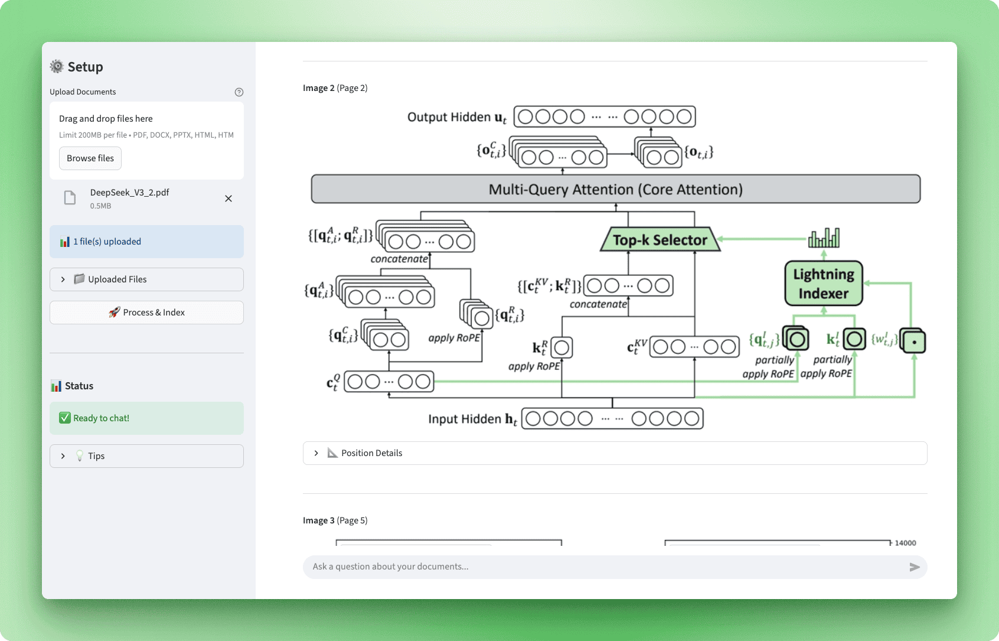

# Document Intelligence Assistant

A powerful Streamlit application that transforms your documents into an intelligent chatbot using Docling for document processing and LangGraph for conversational AI.



## Overview

This application allows you to upload various document formats (PDF, Word, PowerPoint, HTML) and interact with them through a conversational AI interface. It combines IBM's Docling library for advanced document understanding with LangGraph for building sophisticated AI agents.

## Features

### 📄 Multi-Format Document Support
- **PDF documents** - Full text extraction with OCR support
- **Word documents (.docx)** - Complete text and structure preservation
- **PowerPoint presentations (.pptx)** - Slide content extraction
- **HTML files** - Web content processing

### 💬 Intelligent Chat Interface
Ask questions about your documents and get accurate, context-aware answers powered by OpenAI's language models.



### 📊 Document Structure Visualization
Explore your documents in detail with multiple visualization tabs:



- **Summary** - Overview of pages, tables, images, and content types
- **Hierarchy** - Document outline and heading structure
- **Tables** - Interactive table extraction and display
- **Images** - Picture extraction with captions and positioning



### 🔍 Advanced Document Processing
- **Structure preservation** - Maintains document hierarchy, tables, and formatting
- **OCR support** - Handles scanned documents automatically
- **Smart chunking** - Optimized text segmentation for better retrieval
- **Vector search** - Fast and accurate information retrieval using ChromaDB

### 🤖 LangGraph AI Agent
- **Contextual understanding** - Maintains conversation history
- **Tool integration** - Uses vector search to find relevant information
- **Streaming responses** - Real-time answer generation

## Installation

### Prerequisites
- Python 3.8 or higher
- OpenAI API key

### Setup

1. Clone the repository:
```bash
git clone <repository-url>
cd app
```

2. Install dependencies:
```bash
pip install -r requirements.txt
```

3. Configure environment variables:
```bash
cp .env.example .env
```

Edit `.env` and add your OpenAI API key:
```
OPENAI_API_KEY=your_api_key_here
```

## Usage

1. Start the Streamlit application:
```bash
streamlit run app.py
```

2. Upload your documents:
   - Click on the file uploader in the sidebar
   - Select one or more documents (PDF, DOCX, PPTX, or HTML)
   - Click "Process & Index" to process the documents

3. Start chatting:
   - Once processing is complete, navigate to the "Chat" tab
   - Ask questions about your documents
   - Get intelligent, context-aware answers

4. Explore document structure:
   - Switch to the "Document Structure" tab
   - Select a document to analyze
   - View detailed information about content, hierarchy, tables, and images

## Project Structure

```
app/
├── app.py                      # Main Streamlit application
├── requirements.txt            # Python dependencies
├── .env.example               # Environment variables template
├── .gitignore                # Git ignore file
└── src/
    ├── __init__.py           # Package initializer
    ├── agent.py              # LangGraph agent configuration
    ├── document_processor.py # Docling document processing
    ├── structure_visualizer.py # Document structure analysis
    ├── tools.py              # Agent tools definition
    └── vectorstore.py        # Vector store management
```

## Key Dependencies

- **docling (>=2.55.0)** - Document processing and structure extraction
- **langchain (>=0.3.0)** - LLM framework and utilities
- **langchain-docling (>=0.1.0)** - Docling integration for LangChain
- **langchain-openai (>=0.2.0)** - OpenAI integration
- **langgraph (>=0.2.0)** - Agent orchestration and workflow
- **langchain-chroma (>=0.1.0)** - ChromaDB vector store integration
- **streamlit (>=1.28.0)** - Web application framework
- **chromadb (>=0.4.22)** - Vector database for embeddings
- **pandas (>=2.0.0)** - Data manipulation and display

## How It Works

1. **Document Upload**: Users upload documents through the Streamlit interface

2. **Processing with Docling**: Documents are processed using Docling, which:
   - Extracts text with OCR support
   - Identifies document structure (headings, paragraphs, tables)
   - Preserves layout and formatting
   - Extracts images and their captions

3. **Text Chunking**: Processed documents are split into optimized chunks for better retrieval

4. **Vector Store Creation**: Text chunks are embedded and stored in ChromaDB for semantic search

5. **Agent Creation**: A LangGraph agent is configured with:
   - Access to the vector store through a search tool
   - Conversation memory for context
   - Streaming capabilities for real-time responses

6. **Conversation**: Users interact with the agent, which:
   - Searches the vector store for relevant information
   - Generates contextual answers based on document content
   - Maintains conversation history for follow-up questions

## Production Considerations

For production deployment, consider:

- **Persistent storage** - Use a persistent vector database instead of in-memory storage
- **Batch processing** - Handle large document collections more efficiently
- **GPU acceleration** - Speed up OCR and document processing
- **Authentication** - Add user authentication and access controls
- **Caching** - Implement caching for processed documents
- **Rate limiting** - Add API rate limiting for OpenAI calls
- **Error handling** - Enhanced error recovery and logging
- **Monitoring** - Add application monitoring and analytics

## License

This project is provided as-is for educational and demonstration purposes.

## Acknowledgments

- **Docling** by IBM Research for advanced document understanding
- **LangChain** for the LLM framework
- **LangGraph** for agent orchestration
- **Streamlit** for the web interface
- **OpenAI** for language models
