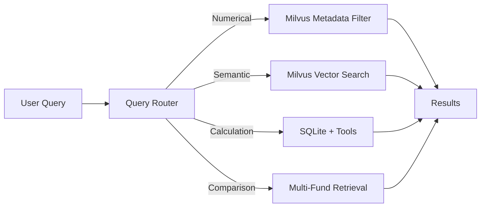
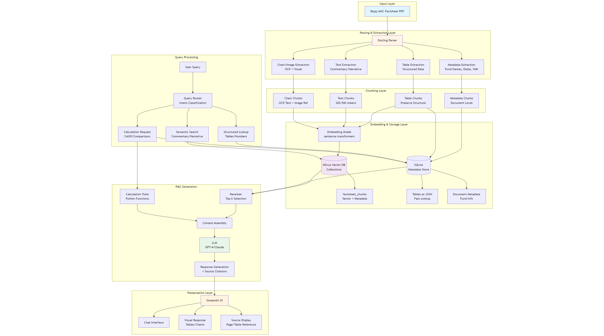

# Bajaj AMC Factsheet Chatbot

> An AI-powered chatbot using Retrieval-Augmented Generation (RAG) to intelligently answer questions from Bajaj Finserv Asset Management Company fund factsheets.

Reference: https://github.com/kartikeyapandey20/Bajaj-Finserv-AMC-Chatbot-Challenge

---

## ⚡ Quick Start (Run in 3 Steps)

```bash
# 1. Install dependencies
pip install -r requirements.txt

# 2. Add your OpenAI API key to .env file
# OPENAI_API_KEY=sk-...

# 3. Run the chatbot UI
streamlit run main.py
```

**The app will open at: http://localhost:8501** 🎉

> **Note:** Data files are already processed and included. No ingestion needed!

---

## 📋 Table of Contents

- [Problem Statement](#problem-statement)
- [Our Approach](#our-approach)
- [High-Level Design](#high-level-design)
- [Architecture Overview](#architecture-overview)
- [Key Features](#key-features)
- [Technology Stack](#technology-stack)
- [Setup & Installation](#setup--installation)
- [Usage](#usage)
- [Example Queries](#example-queries)
- [Project Structure](#project-structure)
- [Evaluation & Results](#evaluation--results)
- [Future Enhancements](#future-enhancements)

---

## 🎯 Problem Statement

Bajaj Finserv AMC releases monthly fund factsheets containing:
- Portfolio holdings and asset allocation
- Performance metrics and returns (1M, 3M, 6M, 1Y, 3Y, 5Y)
- Risk ratios (Sharpe ratio, Sortino ratio, Standard deviation)
- Fund manager commentary and market outlook
- Charts and visual representations

**Challenge:** Build an AI chatbot that can:
1. Read and understand multimodal content (text, tables, charts, images)
2. Answer questions accurately using only factsheet data
3. Perform calculations (CAGR, comparisons, aggregations)
4. Provide source citations for transparency
5. Handle complex queries across multiple funds

---

## 💡 Our Approach

### Core Philosophy: **Hybrid RAG with Multi-Tier Chunking**

We designed a sophisticated chunking strategy that treats different types of content differently, ensuring maximum retrieval accuracy and calculation precision.

### 1. **Intelligent Document Parsing with Docling**

**Why Docling?**
- Advanced PDF understanding with layout analysis
- Preserves table structure (critical for financial data)
- Built-in OCR for charts and images
- Maintains reading order and section hierarchy
- Handles multimodal content seamlessly

**What we extract:**
- ✅ Tables with preserved row-column structure
- ✅ Text paragraphs with semantic boundaries
- ✅ Charts and images with OCR text extraction
- ✅ Metadata (fund names, dates, NAV, AUM)

---

### 2. **Multi-Tier Chunking Strategy**

Rather than using uniform chunking, we employ a **4-tier approach** tailored to content types:

#### **Tier 1: Metadata Chunks** (Document-Level Context)
- Extract once per PDF: Fund names, Report date, NAV, AUM
- **Purpose:** Global filtering and fund identification
- **Storage:** Document-level metadata in both Milvus and SQLite

#### **Tier 2: Table Chunks** (Structured Data Preservation)
Each table becomes a **dual-format chunk**:

```json
{
  "chunk_type": "table",
  "fund_name": "Bajaj Flexi Cap Fund",
  "table_name": "Performance Returns",
  "structured_data": {
    "1M": 2.5,
    "3M": 5.2,
    "6M": 8.1,
    "1Y": 12.5,
    "3Y": 45.2,
    "5Y": 78.3
  },
  "markdown": "| Period | Returns |\n|---|---|...",
  "embedding": [0.234, -0.156, ...],
  "metadata": {
    "page": 2,
    "section": "Performance Metrics"
  }
}
```

**Key tables we preserve:**
- Performance/Returns tables (all time periods)
- Portfolio holdings with weights
- Sector allocation breakdowns
- Asset allocation (Equity/Debt/Cash)
- Risk metrics (Sharpe, Sortino, SD)
- Debt metrics (YTM, Duration, Maturity)

**Critical decision:** Never split tables across chunks - this maintains data integrity for calculations.

#### **Tier 3: Text Chunks** (Semantic Narrative)
- Fund manager commentary: 300-500 tokens per paragraph
- Investment strategy sections: Semantic boundaries
- Market outlook: Preserve full context
- **Overlap:** 10-15% for context continuity

#### **Tier 4: Chart/Image Chunks** (Visual Data)
```json
{
  "chunk_type": "chart",
  "chart_title": "Asset Allocation - Bajaj Flexi Cap",
  "extracted_data": {
    "Equity": "85%",
    "Debt": "10%",
    "Cash": "5%"
  },
  "ocr_text": "Equity 85%, Debt 10%, Cash 5%",
  "image_path": "page3_chart1.png"
}
```

**Benefit:** Users can ask about visual data without manual interpretation.

---

### 3. **Hybrid Retrieval System**

We implement a **smart query router** that directs different query types to optimal retrieval strategies:



**Query Classification Examples:**

| Query Type | Example | Routing Strategy |
|------------|---------|------------------|
| **Numerical Lookup** | "What is 3-year return of Flexi Cap?" | Filter by fund + table name → Direct lookup |
| **Semantic Search** | "What is the investment strategy?" | Vector similarity search on text chunks |
| **Calculation** | "Calculate CAGR for 5Y return" | Retrieve data → Function calling → Compute |
| **Comparison** | "Which fund has highest 3Y return?" | Retrieve all fund tables → Compare → Rank |
| **Chart Query** | "Compare equity vs debt allocation" | Retrieve chart chunks + allocation tables |

---

### 4. **Dual Storage Architecture**

**Why two databases?**

#### **Zilliz Cloud / Milvus (Vector Database)** - For Semantic Understanding
- Stores embeddings of all chunks (384-dim vectors)
- Enables semantic similarity search
- Advanced metadata filtering (fund_name, chunk_type, table_name)
- HNSW index for fast retrieval
- Fully managed with auto-scaling (Zilliz Cloud)
- **Perfect for:** "Explain the fund's investment philosophy" (narrative queries)

#### **SQLite (Structured Store)** - For Precise Lookups
- Stores tables as structured JSON
- Fast exact-match queries
- Document metadata storage
- **Perfect for:** "What is the 3-year return?" (numerical queries)

**Combined Power:** Semantic understanding + computational precision

---

### 5. **Calculation Layer with LLM Function Calling**

For queries requiring computation, we implement **tool-augmented generation**:

```python
# Example tools
calculate_cagr(total_return, years)
calculate_percentage_change(current, previous)
compare_funds(metric, funds_list)
get_top_n_holdings(fund_name, n)
```

**Flow:**
1. User asks: "Calculate CAGR for 3Y return of Flexi Cap"
2. Retrieve structured data: `{"3Y": 45.2%}`
3. LLM identifies need for calculation
4. Function call: `calculate_cagr(45.2, 3)` → Returns `13.2%`
5. LLM generates final answer with source citation

**Benefit:** Accurate calculations with full transparency

---

### 6. **Answer Grounding & Source Citation**

Every response includes:
- ✅ Source table/section name
- ✅ Page number
- ✅ Report date
- ✅ Fund name (for multi-fund queries)
- ✅ Confidence score (optional)

**Example Response:**
```
The 3-year return for Bajaj Flexi Cap Fund is 45.2%, which translates to a CAGR of 13.2% per annum.

📊 Source: Performance Returns Table, Page 2
📅 Report: October 2025
✅ Confidence: 0.95
```

---

## 🏗️ High-Level Design



*Figure: System architecture showing the complete data flow from PDF ingestion to user response generation*

### Design Highlights:

1. **Ingestion Pipeline**
   - PDF Upload → Docling Parser → Multi-tier Chunker → Embeddings → Dual Storage

2. **Query Pipeline**
   - User Query → Intent Classifier → Smart Router → Hybrid Retrieval → Context Assembly → LLM Generation

3. **Calculation Pipeline**
   - Query → Data Retrieval → Function Calling → Computation → Response Integration

4. **UI Layer**
   - Streamlit chat interface with PDF upload, conversation history, and visual response rendering

---

## ✨ Key Features

### 🎯 Core Capabilities

- ✅ **Multimodal Understanding**: Reads text, tables, charts, and images
- ✅ **Precise Calculations**: CAGR, percentage changes, comparisons, aggregations
- ✅ **Multi-Fund Support**: Query across different funds in single factsheet
- ✅ **Source Attribution**: Every answer cites page number and source table
- ✅ **Context-Aware**: Handles follow-up questions with conversation memory
- ✅ **Visual Responses**: Renders tables and charts in chat interface

### 🚀 Advanced Features

- **Smart Query Routing**: Automatically detects query intent and uses optimal retrieval strategy
- **Hybrid Retrieval**: Combines semantic search with structured lookups
- **Calculation Tools**: Built-in functions for financial computations
- **Confidence Scoring**: Shows retrieval confidence for transparency
- **Multi-Document Support**: (Bonus) Compare across multiple factsheet months
- **Visual Regeneration**: (Bonus) Recreates charts using Plotly for clarity

---

## 🛠️ Technology Stack

### Core Technologies

| Component | Technology | Version | Purpose |
|-----------|-----------|---------|---------|
| **PDF Parsing** | Docling | Latest | Extract text, tables, charts with structure |
| **Embeddings** | sentence-transformers | Latest | Convert text to 384-dim vectors |
| **Vector DB** | Zilliz Cloud (Managed Milvus) | 2.3+ | Scalable vector storage and search |
| **Structured DB** | SQLite | 3.x | Fast table lookups and metadata |
| **LLM** | LLM | API | Answer generation and function calling |
| **Framework** | LangChain + LangGraph | Latest | RAG orchestration, tools, and state management |
| **UI** | Streamlit | Latest | Interactive chat interface |
| **Visualization** | Plotly | Latest | Chart rendering in responses |
| **Data Processing** | Pandas | Latest | Table operations and transformations |

## 📦 Setup & Installation

### Prerequisites

- Python 3.11+
- LLM API Key
- Zilliz Cloud account (free tier available) or Docker Desktop (for local Milvus)

### Step 1: Clone Repository

```bash
git clone <repository-url>
cd bajaj-problem-statement
```

### Step 2: Create Virtual Environment

```powershell
python -m venv .venv
.venv\Scripts\Activate.ps1
```

### Step 3: Install Dependencies

```powershell
pip install -r requirements.txt

# Key packages installed:
# - docling (PDF parsing)
# - langchain, langchain-<llm>, langgraph (RAG framework)
# - pymilvus (Zilliz Cloud client)
# - sentence-transformers (embeddings)
# - streamlit (UI)
# - plotly, pandas (visualization & data)
```

### Step 4: Configure Milvus Connection

**Using Zilliz Cloud (Managed Milvus):**

1. Sign up at [Zilliz Cloud](https://cloud.zilliz.com/)
2. Create a new cluster (Free tier available)
3. Note your cluster endpoint and API key

```powershell
# No local Docker setup needed!
# Zilliz provides fully managed Milvus
```

**Alternative: Local Milvus (Docker)**
```powershell
# If you prefer self-hosted
docker-compose up -d
docker ps
```

### Step 5: Configure Environment

```powershell
# Create .env file
cp .env.example .env

# Edit .env and add your LLM API key
notepad .env
```

```env
# .env file
LLM_API_KEY=your-<llm>>-api-key-here

# Zilliz Cloud (Managed Milvus) - Recommended
MILVUS_URI=https://your-cluster.api.gcp-us-west1.zillizcloud.com
MILVUS_TOKEN=your-zilliz-api-token

# OR for local Milvus (Docker)
# MILVUS_HOST=localhost
# MILVUS_PORT=19530

# Embedding configuration
EMBEDDING_MODEL=sentence-transformers/all-MiniLM-L6-v2
```

### Step 6: Process Factsheet

```powershell
# Run the ingestion pipeline
python src/ingest_factsheet.py --pdf bajaj_finserv_factsheet_Oct.pdf
```

### Step 7: Launch Chatbot

```powershell
# Start Streamlit UI
streamlit run src/app.py
```

Open browser at: `http://localhost:8501`

---

## 🎮 Usage

### Basic Workflow

1. **Upload PDF** (if not pre-processed)
   - Click "Upload Factsheet" in sidebar
   - Select PDF file
   - Wait for processing confirmation

2. **Ask Questions**
   - Type query in chat input
   - Press Enter or click Send
   - View response with source citations

3. **Follow-up Questions**
   - Context is maintained across conversation via LangGraph state
   - Reference previous answers naturally
   - Conversation history preserved

### Tips for Best Results

✅ **Be specific with fund names**: "Flexi Cap" instead of "the fund"  
✅ **Use exact metric names**: "3-year return" instead of "recent performance"  
✅ **Request calculations explicitly**: "Calculate CAGR" if needed  
✅ **Ask for sources**: System auto-cites, but you can request "Show source"

---

## 💬 Example Queries

### Basic Lookups

```
Q: What is the 3-year return of Bajaj Flexi Cap Fund?
A: The 3-year return for Bajaj Flexi Cap Fund is 45.2%
   📊 Source: Performance Returns Table, Page 2
```

### Holdings & Portfolio

```
Q: List top 5 holdings of the Consumption Fund with weights
A: Top 5 holdings for Bajaj Consumption Fund:
   1. Reliance Industries - 8.5%
   2. HDFC Bank - 7.2%
   3. Infosys - 6.8%
   4. TCS - 5.9%
   5. ITC - 5.1%
   📊 Source: Portfolio Holdings Table, Page 3
```

### Comparisons

```
Q: Compare the allocation between equity and debt
A: Asset allocation for Bajaj Flexi Cap Fund:
   - Equity: 85%
   - Debt: 10%
   - Cash & Equivalents: 5%
   
   This shows a strong equity bias suitable for growth-oriented investors.
   📊 Source: Asset Allocation Chart, Page 4
```

### Calculations

```
Q: Calculate the CAGR for 5-year return of Consumption Fund
A: The 5-year total return is 82.3%, which translates to:
   
   CAGR = (1 + 0.823)^(1/5) - 1 = 12.8% per annum
   
   📊 Source: Performance Returns Table, Page 2
   🔧 Calculation: calculate_cagr(82.3, 5)
```

### AUM Changes

```
Q: How has AUM changed compared to last month?
A: AUM has increased by 5.2% from ₹1,200 Cr to ₹1,262 Cr
   (Growth of ₹62 Cr month-over-month)
   📊 Source: Fund Metadata, October 2025
```

### Cross-Fund Analysis

```
Q: Which of the listed equity funds has the highest 3-year return?
A: Among the equity funds, Bajaj Flexi Cap Fund has the highest 3-year 
   return at 45.2%, followed by Consumption Fund at 38.7%
   📊 Source: Performance comparison across all equity funds
```

### Risk Metrics

```
Q: State the YTM, Macaulay Duration and Average Maturity for Money Market Fund
A: For Bajaj Money Market Fund:
   - Yield to Maturity (YTM): 7.2%
   - Macaulay Duration: 0.42 years
   - Average Maturity: 0.38 years
   📊 Source: Debt Metrics Table, Page 5
```

---

## 📁 Project Structure

```
bajaj-problem-statement/
├── src/
│   ├── app.py                      # Streamlit UI
│   ├── ingest_factsheet.py         # PDF processing pipeline
│   ├── chunking/
│   │   ├── __init__.py
│   │   ├── docling_parser.py       # Docling integration
│   │   ├── chunker.py              # Multi-tier chunking logic
│   │   └── metadata_extractor.py   # Metadata extraction
│   ├── storage/
│   │   ├── __init__.py
│   │   ├── milvus_store.py         # Zilliz Cloud operations
│   │   └── sqlite_store.py         # SQLite operations
│   ├── retrieval/
│   │   ├── __init__.py
│   │   ├── query_router.py         # Intent classification
│   │   ├── hybrid_retriever.py     # Hybrid search logic
│   │   └── reranker.py             # Result reranking
│   ├── generation/
│   │   ├── __init__.py
│   │   ├── rag_graph.py            # LangGraph RAG workflow
│   │   ├── tools.py                # Calculation functions
│   │   └── response_formatter.py   # Citation formatting
│   └── utils/
│       ├── __init__.py
│       ├── config.py               # Configuration
│       └── embeddings.py           # Embedding utilities
├── tests/
│   ├── test_chunking.py
│   ├── test_retrieval.py
│   └── test_calculations.py
├── data/
│   ├── bajaj_finserv_factsheet_Oct.pdf
│   └── processed/                  # Extracted chunks
├── docker-compose.yml              # Milvus setup
├── requirements.txt                # Python dependencies
├── .env.example                    # Environment template
├── ARCHITECTURE.md                 # Detailed architecture docs
├── README.md                       # This file
└── HLD.png                         # High-level design diagram
```

---

## 📝 License

This project is developed as part of the Bajaj Finserv AMC Chatbot Challenge.

---

