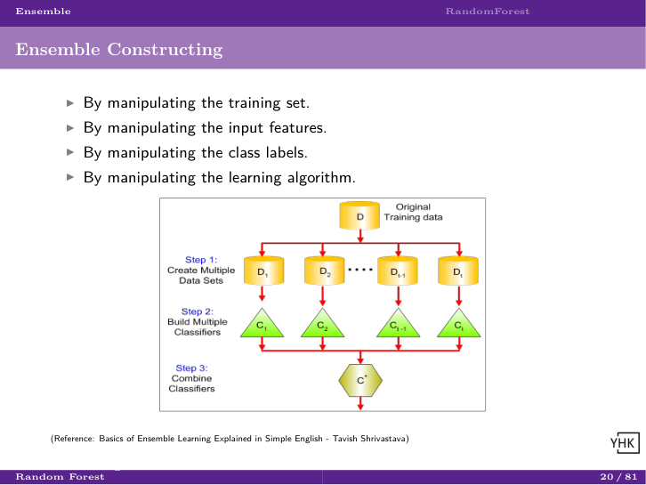
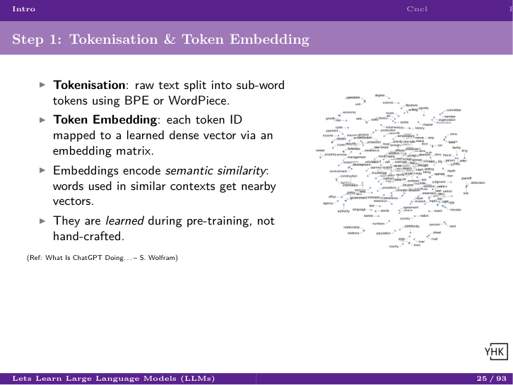
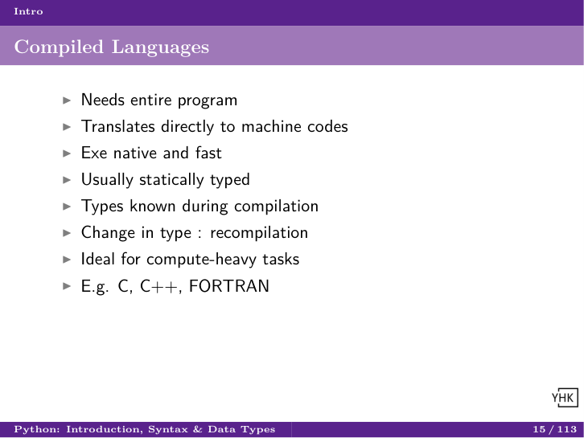

# Teaching Data Science

<p align="center">
<b>Free, open-source Beamer slide decks and code for Machine Learning, Deep Learning, NLP, Generative AI, Maths for ML, and Python, from 1-hour seminars to full courses.</b>
</p>

<p align="center">


</p>

Everything here, including slides, code, and notes, has been built by learning from, and citing, the best public material available, and is given back under an open license so anyone can teach, learn, or build on it.

## See It In Action

A few sample slides, actual output from the `.tex` sources in this repo, no editing:

<table>
<tr>
<td></td>
<td></td>
<td></td>
</tr>
</table>

## What's in here

Content comes in three tiers, so you can pick exactly the depth you need:

- **Courses** (full curriculum, ~1-2 weeks / ~40 hrs): Machine Learning, Deep Learning, Generative AI, Maths for ML, Python
- **Workshops**: one topic in depth, ~1-2 days (8-16 hrs)
- **Seminars**: a focused session, ~1-2 hrs

Workshops and seminars span far more ground than the courses above: classical ML, linear algebra, LLMs, RAG, LangGraph, GNNs, blockchain, career advice, and more. There's also a growing set of runnable code projects in [`Code/`](Code/): LangChain, LangGraph, RAG pipelines, fine-tuning, classical ML, NLP, graph neural networks, and more.

Every seminar/workshop compiles to **both** Beamer slides and two-column printable "cheat sheet" notes from the same source `.tex` files.

## Course Catalog

| Course | Covers | Driver |
|---|---|---|
| Machine Learning | Python for ML → foundations → regression → trees/ensembles → KNN/SVM/Naive Bayes → clustering → dimensionality reduction → deployment | [`Main_Course_MachineLearning_Presentation.tex`](LaTeX/Main_Course_MachineLearning_Presentation.tex) |
| Maths for ML | Basics → linear algebra → calculus → statistics; built for fresher/college-level students | [`Main_Course_MathsML_Presentation.tex`](LaTeX/Main_Course_MathsML_Presentation.tex) |
| Python | Basic Python, then Advanced Python | [`Main_Course_Python_Presentation.tex`](LaTeX/Main_Course_Python_Presentation.tex) |
| Deep Learning | Prerequisites → neural network foundations → TensorFlow & PyTorch → self-organizing maps, autoencoders | [`Main_Course_DeepLearning_Presentation.tex`](LaTeX/Main_Course_DeepLearning_Presentation.tex) |
| Generative AI | NLP fundamentals → deep NLP (BERT, embeddings) → LLMs, ChatGPT, prompt engineering, autonomous agents, LangChain, LangGraph, LlamaIndex, advanced RAG | [`Main_Course_GenerativeAI_Presentation.tex`](LaTeX/Main_Course_GenerativeAI_Presentation.tex) |

Each course is assembled from standalone **workshops**, which are assembled from standalone **seminars**, so you don't have to take the whole course to get value; jump straight into any one workshop or seminar that matches what you need.

## Beyond these courses

Many more standalone workshops and seminars exist outside the courses above, covering NLP (spaCy, Rasa chatbots, deep NLP), LLMs & GenAI (RAG, LangChain, LangGraph, agents, Docling), Graph ML (knowledge graphs, geometric deep learning, graph databases), Reinforcement Learning, Blockchain, Software Engineering practices, Data Analytics, and career/interview-prep seminars. See [`COURSES.md`](COURSES.md) for the full catalog.

## Code Projects

`Code/` has runnable Python/notebook projects, organized by area:

| Category | Examples |
|---|---|
| GenAI / Agents | `langchain/`, `langgraph/`, `llamaindex/`, `crewai/`, `agents/`, `agno/`, `google-adk/` |
| RAG Applications | `chatbot-faqs/`, `chatbot-multimodal/`, `omni-rag/`, `parsing/`, `graphrag/` |
| LLM Fine-tuning | `fine-tuning/`, `ludwig/`, `gemma/` |
| Document Parsing | `docling/`, `opendataloader/` |
| Deep Learning | `keras/`, `dl_tf2/`, `pytorch/`, `deep_rl/` |
| Classical ML | `ml/`, `math/`, `python/` |
| NLP | `nlp/`, `dnlp/`, `spacy/` |
| GNN | `pyg/` |
| Indic Language | `mahamarathi/`, `sarvam/`, `orgpedia/` |

Each project has its own `environment.yml` (conda) and, for most, a `test_*.py` suite runnable with `pytest`.

## Mission

- **Mission**: Spread knowledge of Data Science to a wider audience.
- **Vision**: Let many participate in the industry moving "From Automation to Autonomy."
- **Values**: Give back, pay it forward.

## Getting Started

This is a LaTeX repository. Slides compile to PDF; they aren't checked in pre-built. To try one:

```
cd LaTeX
texify -cp Main_Seminar_ML_Intro_Presentation.tex
```

Requirements: a LaTeX distribution (MikTeX or TeX Live); install packages as prompted. Every seminar and workshop has both a `_Presentation.tex` (slides) and a `_CheatSheet.tex` (two-column notes) driver. Compile either.

### Code Arrangement

- **`LaTeX/`**: `.tex` sources and images. Naming: `subject_maintopic_subtopic.tex` (e.g. `maths_linearalgebra_matrices.tex`). Driver files: `Main_[Seminar|Workshop|Course]_<Subject>_[Presentation|CheatSheet].tex`. Content hierarchy: **Course** (40hr) → **Workshop** (4-16hr) → **Seminar** (1hr) → raw topic files.
- **`Code/`**: runnable Python/notebook files with necessary images and data, named to match their corresponding `.tex` file where applicable.
- A `References/` directory (papers, code, slides used as source material) exists locally but isn't uploaded, since most of it belongs to others' repos rather than original work.

## How to Contribute

See [`CONTRIBUTING.md`](CONTRIBUTING.md): corrections, new topics, code examples, and citation fixes are all welcome.

## Disclaimer

Notes have been built from lots of publicly available material; care has been taken to cite sources, but some may be missing. Point them out and they'll be fixed. Don't depend on this fully; there's always more to improve.

---

Connect: [LinkedIn](https://www.linkedin.com/in/yogeshkulkarni/)

Copyright (C) 2019 Yogesh H Kulkarni · [MIT License](LICENSE)
